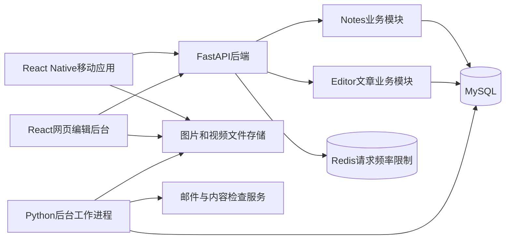

# 第一版架构与实施方案

> 当前仓库处于设计阶段。本文定义拟实现的行为，不代表应用已经写完。首发中国大陆上海，数据库MySQL，使用邮箱验证码注册和登录，第一版不做Agent。

## 1. 产品范围

Discover包含两种内容。Editor制作专业文章，可以选择介绍一个地点，也可以选择介绍一项活动；普通用户发布Notes，用简单文字和照片分享体验。两者的创作工具、存储结构和阅读展示分别设计。

| 功能 | 第一版实现范围 |
|---|---|
| 登录 | 邮箱验证码注册和登录，无需密码；首次验证成功才创建账户。 |
| Editor文章 | 可以选择地点或活动为重心。支持专业正文排版，在指定位置插入图片、视频和超链接。 |
| Notes | 可选标题、普通文字和有序图片，支持草稿、发布、编辑和删除。 |
| Discover | 两个独立内容列表，分别呈现编辑文章和用户帖子。 |
| 标签 | Editor给文章选多个标签，为后续搜索筛选和合集整理提供依据。 |
| 搜索与个人 | 搜索先保留入口；个人入口提供资料、我的帖子、草稿、收藏和退出。 |
| 基础互动 | 分别对文章和帖子点赞、收藏、举报；活动可标记想去或去过；可屏蔽用户。 |
| 暂不实现 | Agent、聊天、个性化画像、AI写稿、完整搜索合集、评论、私信。 |

目前顶部第一个Tab仍沿用“活动”这个暂定名称，但它承载的Editor内容已经包括餐厅、公园等地点主题。名称是否改成“精选”等更宽泛表达，留作界面阶段的产品选择，本轮不擅自更名，也不因此排除地点文章。

已确认邮箱验证码为唯一登录方式，不保留手机号字段。图片和视频放在文件存储服务中，MySQL保存文件信息。封面和照片始终可选，公开内容可以没有任何图片。

### 前端视觉方向

已确认以卡其色为主、深绿色为辅。卡其色及其浅色用于页面背景、导航底色和内容区域，深绿色用于主要按钮、当前选中的导航、链接和收藏状态。正文使用深色，避免浅卡其色文字在浅背景上难以阅读。

以下色值是本项目的初步提案，不是从Mars界面提取的颜色；后续在真实手机页面上检查阅读效果再调整。

| 用途 | 初步色值 | 使用位置 |
|---|---|---|
| 主色卡其 | `#C6B58E` | 导航底色、强调区域和标签背景 |
| 浅卡其 | `#F3EFE6` | 页面主要背景 |
| 暖白 | `#FAF8F2` | 阅读区域、输入框和卡片底色 |
| 辅助深绿 | `#214638` | 主要按钮、选中状态和链接 |
| 正文深色 | `#242A24` | 标题和正文 |
| 次要文字 | `#62665B` | 日期、区域和说明文字 |

用户指定Mars作为主要设计参考。目前暂按“mars新鲜好去处”这款城市生活应用理解；具体版本和页面尚未确认，也尚未完成其实际界面的逐页核对。因此，下列内容是Marcus拟采用的方向，不声称已经复刻Mars。

Editor列表采用杂志式编排，以图片、标题、摘要和城市／区信息建立层次；没有封面时使用完整的文字版式，不显示空图片框。阅读页强调正文节奏、图注与留白，并按地点或活动重心安排实用信息。Notes继续使用双列瀑布流，纯文字帖子同样有完整卡片。减少重阴影和装饰，让内容照片成为主要视觉元素。

底部仍为Discover、搜索、个人三个入口，Discover顶部仍保留“活动”和“Notes”。颜色和间距后续统一保存在共享的design-tokens包中，让移动端和编辑后台引用同一份数值；编辑后台的文章预览应还原手机阅读效果。第一版不增加Agent入口。

## 2. Editor选择文章重心

餐厅和公园本身就值得介绍，不需要额外存在一场活动。编辑选择“地点”为重心，填写主要地点后，就可以围绕环境、特色、营业与到访体验写文章。文章详情突出地点信息，不出现空的活动区域。

演出和展览则可以选择“活动”为重心。标题、演出或展览介绍、日期场次、票价和预约方式成为重点；场馆地址作为到访信息。即使几篇文章涉及同一个场馆，也不会把各场演出压缩成场馆附属介绍。

| Editor选择 | 必须选择的主要对象 | 不需要填写的对象 | 页面重点 |
|---|---|---|---|
| 地点 | 一个地点，例如一家餐厅 | 活动，不创建占位活动 | 地点名称、环境与特色、营业和到访信息 |
| 活动 | 一个活动，例如一场演出 | 文章不重复选择主要地点，场地从活动读取 | 活动名称、内容亮点、场次、票价和预约信息 |

数据库把重心写为focus_type，值为place或event。每个正式文章版本只填写对应的primary_place_id或primary_event_id。场地暂未公布的活动允许地点为空，界面明确显示“地点待公布”；活动城市仍必须明确。首版仍是一篇文章围绕一个主要对象，合集与跨场地活动另行设计。

文章主表editor_articles同时保存城市city_id和所属区district_id，便于按上海的不同区浏览。地点文章使用地点所在区，活动文章使用已确认举办地所在区；区尚未确认时暂留空。详情和卡片返回区的信息，列表支持按区筛选。

编辑切换重心时，工作稿里的旧主要对象同时清空。新稿提交并通过审核前，公开文章仍使用之前的重心和正文。不是修改一个文章类型字段就立刻把读者页面切走。

## 3. 两种内容为什么分开建模

Notes的创作是“写几句或一段体验，选几张照片，调整照片顺序，然后发布”。它保存普通文字和图片列表，不需要解释小标题、图注、正文视频块和复杂排版。手机使用原生文字输入框和图片选择器即可。

Editor创作的是完整文章：可能先写导语，再插一张大图，接着两段文字、一个视频和引用段落。后端必须保存这些内容的先后顺序及排版设置，阅读页才能准确还原编辑安排。Editor使用网页专业编辑器，文章正文保存为一组有明确类型和属性的内容块。

| 方面 | 用户Notes | Editor文章 |
|---|---|---|
| 输入工具 | 手机原生文字输入和图片选择 | 编辑后台的专业网页编辑器 |
| 文字格式 | 普通文字和换行，可选标题 | 标题、副标题、导语、小标题、正文、引用和列表 |
| 图片 | 有序图片组，首图作为列表展示图；无图也可发布 | 可以放在正文指定位置，支持图注、来源署名和宽度选择 |
| 视频 | 第一版不提供视频发帖 | 可以插入正文指定位置 |
| 链接 | 文本中的网址按普通文字保存，可在阅读时安全识别 | 可以给选定文字加链接，也可以放在图注说明中 |
| 数据模型 | notes、note_drafts、note_submissions、note_images | editor_articles、editor_drafts、editor_revisions及各自关系表 |
| 审核与编辑 | 保存简单字段的提交副本，批准后替换公开帖子 | 保存固定文章版本，批准后切换公开版本 |

两者不共用contents主表、不共用document正文结构，也不共用草稿接口的数据模型。登录、媒体存储、请求去重等基础代码可以复用；这种复用不把两种产品强行变成同一种内容。

Notes保留一次提交的副本，是为了审核期间作者仍可继续修改草稿，并避免旧审核结果覆盖新帖子。它不为用户增加“文章历史版本管理”功能，也不会要求用户使用专业编辑器。

## 4. Editor专业排版怎样实现

正文按顺序保存内容块。例如“导语、图片、正文、视频、正文”就按这个顺序保存，手机按这个顺序展示。图片和视频存媒体编号、说明及显示方式；链接保存目标地址。正文不允许插入任意脚本或任意网页代码。

第一版支持标题层级、段落对齐、加粗与斜体、列表、引用、分隔线、提示框、图片、图片组、视频和超链接。编辑还可填写图注和来源署名，选择正文宽度、大图或通栏展示。双图并排等版式在窄手机屏幕上可顺序堆叠，优先保持阅读顺序和可读性；“专业排版”不表示所有设备都强制照搬报纸纸张的多栏宽度。

编辑后台拟使用Tiptap并增加适合本文格式的自定义内容块。Tiptap支持在编辑器中实现自定义内容节点，但每个节点如何保存、如何在手机阅读页显示仍需要我们编写，不能认为装一个编辑器就完成全部版式。[Tiptap自定义节点说明](https://tiptap.dev/docs/editor/extensions/custom-extensions/node-views)

手机阅读Editor文章使用按允许块类型实现的阅读组件，图片在原位置展示，视频使用原生播放组件；可以采用Expo提供的视频播放库。Notes页面不加载专业编辑器。[Expo视频组件说明](https://docs.expo.dev/versions/latest/sdk/video/)

## 5. 后端与部署

移动应用和编辑后台都请求同一套FastAPI后端。后端按登录、地点活动、Notes、Editor文章、媒体和审核等职责分模块，使用同一个MySQL数据库。第一版不拆微服务。

后台处理图片、转码视频、发送验证邮件和执行内容检查时，使用单独的Python工作进程。请求进程把待办工作写入MySQL，后台进程领取并执行。第一版不额外部署独立消息队列服务，任务重试和去重在当前设计中明确处理。



上图中的两个内容模块在同一个后端应用中运行，它们不是两个独立微服务。工作进程也复用这套代码。Editor后台在浏览器使用，第一版不需要Electron桌面端。

## 6. 技术选型与目录

| 用途 | 选型 | 职责 |
|---|---|---|
| 移动应用 | TypeScript、React Native、Expo、Expo Router | 实现手机页面、构建和导航。 |
| 前端数据请求 | TanStack Query | 管理服务器数据的加载、缓存、失败和刷新。 |
| Notes输入 | React Native原生文字输入和相册选择 | 简单文字与照片，不承载Tiptap网页编辑器。 |
| Editor后台 | React、TypeScript、Vite、Tiptap及自定义内容块 | 管理资料与专业文章，提供预览和审核。 |
| Editor手机阅读 | 原生文章块组件和expo-video | 根据正文结构显示排版与媒体。 |
| 后端 | Python、FastAPI、Pydantic | 处理请求、业务规则和数据校验。 |
| 数据库 | MySQL 8.4、InnoDB、SQLAlchemy 2、asyncmy、Alembic | 保存数据和管理表结构变更。 |
| 文件存储 | 兼容S3接口的对象存储，可配文件分发缓存 | 保存图片原图、视频原文件、处理结果和缩略图。 |
| 请求频率限制 | Redis | 限制验证码发送及其他高频请求。 |
| 依赖管理 | 前端pnpm，后端uv | 分别锁定依赖；根目录统一开发命令。 |

下面是当前仓库结构。后端按业务建立子包，数据库表模型和请求、响应定义有独立目录。具体文件职责见[后端代码导航](../../apps/backend/README.md)。

```text
Marcus/
  apps/
    mobile/                  # Notes创作、Discover和文章阅读
    editor/                  # Editor专业创作与审核网页后台
    backend/
      src/marcus/
        main.py              # HTTP服务入口
        controllers/         # 接收请求、调用业务函数和返回响应
        services/            # 登录、内容、审核和社区业务规则与流程
        repositories/        # 登录、笔记、文章及地点活动的成组查询和关联写入
        models/              # 按业务拆分的数据库表类、约束与索引
        schemas/             # 按业务拆分的请求字段及响应定义
        jobs/                # 执行邮件、媒体和清理等后台任务
        scripts/             # 初始化上海资料与可选管理员
        core/                # 配置、数据库连接和共用函数
      migrations/
      tests/
  packages/
    api-client/              # 前端共用请求封装与生成的接口类型
    editorial-schema/        # 专业正文格式与校验，不用于Notes
    editorial-editor/        # 网页专业编辑器组件，只供后台使用
    design-tokens/           # 配色、间距和圆角
  contracts/                 # 后端导出的接口说明
  infra/                     # 本地基础服务配置
  docs/architecture/
```

后端Pydantic分别定义NoteDraft和EditorialDraft等输入输出。FastAPI导出OpenAPI接口说明，前端生成类型。Notes没有RichDocument类型；Editor正文的每种块都有单独的字段校验与版本号。数据库表对象不能未经筛选直接作为响应返回。

## 7. 媒体和公开内容

图片、视频文件不存进MySQL二进制字段，也不依赖应用服务器本地磁盘永久保存。数据库记录媒体编号、类型、上传者、处理状态和存储位置。

Notes只接受图片。Editor可上传图片和视频；后台探测真实格式后生成手机可播放的视频和预览图。处理完成才允许文章提交，视频错误必须指出具体媒体。默认先限制单视频200MB、5分钟、每篇最多5个视频；这些是待实测调整的工程初值，不是用户已经指定的限制。

文章封面完全可选，即使正文包含视频，也不要求设置文章封面。播放器预览图由视频处理生成，它与cover_asset_id是不同用途。地点没有照片、文章无图、Note只有文字，都有明确的无图展示。

公开版本和工作草稿分离。阅读接口只取正式公开数据；未公开的媒体通过授权访问。隐藏和删除内容会影响媒体的公开引用，清理时还要检查保留中的草稿和审核提交，避免丢失正在编辑的文件。

## 8. 实施顺序与验收

| 阶段 | 交付内容 | 重点验证 |
|---|---|---|
| 1 | 仓库、MySQL、邮箱登录、上传基础 | 验证码不会重复消费，文件权限正确。 |
| 2 | Notes原生输入、草稿、图文发布和列表 | 纯文字可发；图片顺序不丢；没有专业排版字段。 |
| 3 | 地点、活动与两种文章重心 | 餐厅没有活动也能写文章；演出文章突出活动信息。 |
| 4 | Editor专业编辑器、文章发布与手机阅读 | 图片视频在指定位置，链接和图注保留，封面可空。 |
| 5 | 两套审核、互动、标签与上线准备 | 旧审核不覆盖新提交，内容下架不可绕过，媒体可清理。 |

Editor排版原型必须同时验证后台预览和iOS/Android真实阅读效果。不能只测JSON能够保存，也不能只测桌面编辑器好看，就认为手机上的视频、字体、长链接和大图都已可用。

数据库详见[表与字段说明](02-data-model.md)，前后端交换字段见[接口说明](03-api-contracts.md)，审核和媒体执行见[内容发布流程](04-content-publishing.md)。对应业务代码已实现，实际后端测试及前端构建范围见[验证记录](../development/verification.md)。
