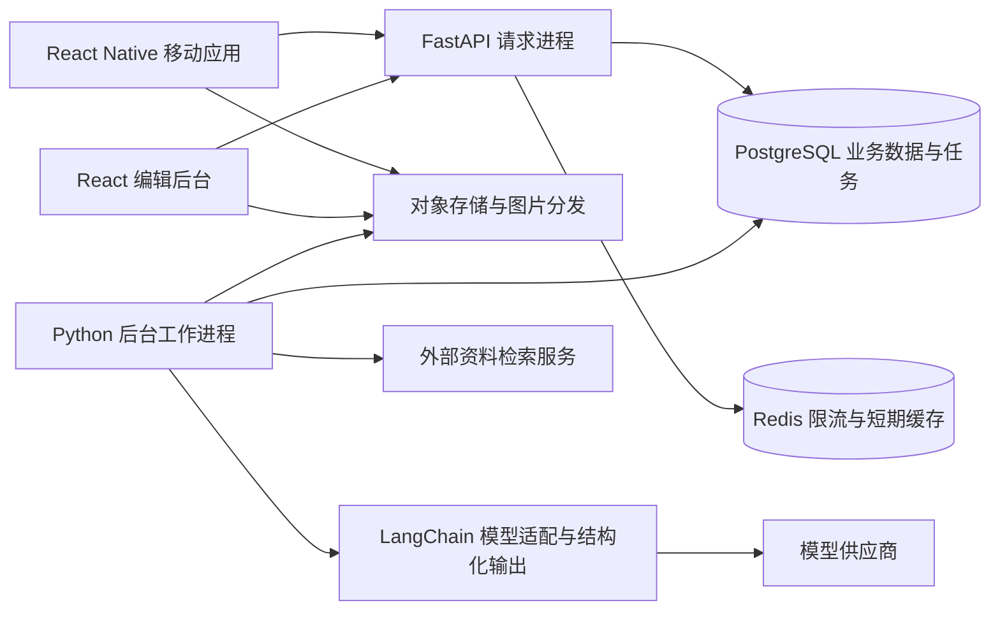

# 第一版架构与实施方案

> 状态：拟实施技术方案；2026-09-24 检查时仓库只有 Git 元数据，没有前后端代码。本文中的类、目录、接口和表名均为设计约定。相关库的能力已查阅官方资料，具体依赖版本在初始化与兼容性验证后锁定。

## 1. 直接结论与范围

建议在一个仓库中维护移动客户端、轻量编辑后台和 Python 后端。后端先做一个按业务拆分的应用，另起后台工作进程处理图片、审核与模型生成。两种进程使用同一套业务代码和数据库，第一版不拆微服务。

Discover 的两条内容流共享基础内容能力，但保持来源边界：“活动”只展示平台编辑文章；“Notes”只展示用户主动创作和发布的笔记。真实活动、场次与地点独立保存，供文章引用和 Agent 检索；不能把一篇推荐文章直接当作一场活动。

| 第一版完整实现 | 第一版最小支持 | 后续扩展 |
|---|---|---|
| 登录、退出、会话续期、账户停用处理 | 手动选城市和兴趣 | 多种第三方登录 |
| Discover 编辑精选、Notes 瀑布流及详情 | 搜索入口和待开放状态，不调用不存在的搜索接口 | 全站搜索、地图、复杂筛选 |
| Notes 草稿、富文本、图片、编辑、发布、删除 | 个人页展示资料、我的笔记/草稿/收藏及退出入口 | 完整个人主页、关注关系、私信 |
| 悬浮 Agent、三个方向、选项追问、推荐文章、自由输入 | 收藏、点赞、活动“想去/去过” | 评论、票务交易、真实签到、社交推荐 |
| Editor 内容创建、引用资料、审核、发布、下架 | 举报、用户屏蔽与后台处置 | 完整内容运营平台 |

个人模块虽暂不做完整产品，但必须提供找回草稿、编辑自己的笔记、查看收藏的路径，否则创作和推荐闭环不完整。“去过”是用户自报记录，不代表平台核实参与或购票。

**已确认：**首发地区为中国大陆，首发城市为上海。初始化上海城市记录、`Asia/Shanghai` 时区与行政区数据；表结构支持后续多城市。**工作假设：**iOS/Android 双端、手机号验证码登录。短信、对象存储、模型供应商和部署地区通过适配器配置，不把一家供应商写死进业务；未确认项保留为可替换配置。

## 2. 运行时由谁做什么

用户打开 Discover 后，移动应用请求后端获取内容卡片。后端查询已发布内容和活动资料，把卡片与图片尺寸返回客户端；客户端绘制杂志卡片或双列瀑布流，图片从文件分发服务加载。

用户打开 Agent 时，客户端提交当前城市、当前 Tab 和可见卡片编号。后端核验这些内容仍可访问，补充该用户允许使用的浏览、收藏和参与记录，然后建立一次推荐会话并用规则返回三个方向。后续模型生成由后台工作进程执行；客户端查询进度并展示后端已经确认的追问或推荐文章。

用户编辑 Note 时，正文先保存在设备草稿，再同步服务器草稿。发布操作创建一个不可变版本，交给审核任务；只有该版本通过检查后，后端才把它设为公开版本。模型与图片处理慢，不会占用一个持续不结束的发布请求。



图中的 FastAPI 请求进程接收网络请求、检查权限、读写数据库；后台工作进程从数据库领取待办任务。Redis 丢失不会丢失草稿、已发布内容或 Agent 结果。第一版轮询持久化进度即可，不把长连接作为核心流程成立的前提。

## 3. 技术选择与边界

| 需求 | 选型 | 使用位置与理由 |
|---|---|---|
| 跨平台移动应用 | TypeScript、React Native、Expo development build、Expo Router | 移动端页面与导航；提前做双端富文本及图片上传真机验证 |
| 服务端数据获取 | TanStack Query | 移动端缓存列表、详情、草稿同步状态；数据库仍是服务器事实来源 |
| 少量本地界面状态 | React state，跨页面状态必要时 Zustand | 当前城市、Agent 面板开关等；不再复制一份完整远端内容缓存 |
| 富文本输入 | 本地打包的 Tiptap 网页 + react-native-webview | 网页编辑器处理段落、链接和选区；原生侧负责相册、上传和导航 |
| 编辑后台 | React + TypeScript + Vite | 只做资料维护、文章编辑和审核；不引入另一套 Python 管理系统 |
| 网络接口 | FastAPI、Pydantic 2 | 校验请求、声明返回结构、导出机器可读接口描述 |
| 关系数据 | PostgreSQL，SQLAlchemy 2，Alembic | 保存内容与会话；SQLAlchemy 映射 Python 对象和表，Alembic 管理表结构变更 |
| 后台任务 | PostgreSQL 持久化任务表 + 独立 Python worker | 发布和任务入库在同一事务完成，避免第一版引入额外消息系统 |
| 缓存与限流 | Redis | 登录限流、短期 Feed 快照；不可用时采用明确的降级策略 |
| 图片 | 兼容 S3 接口的对象存储 + CDN | 存图片文件、缩略图；CDN 即分布式文件缓存，用于减少远端下载耗时 |
| Agent | LangChain + LangGraph | 前者适配模型和工具；后者保存可恢复的多步骤生成进度 |
| Python/JS 依赖 | uv / pnpm workspaces | 各自锁定 Python 和 TypeScript 依赖；根 Makefile 统一开发命令 |

Expo 官方支持 workspace monorepo；配置遵循当前官方默认，不复制旧版手工 Metro 设置。[Expo monorepo 文档](https://docs.expo.dev/guides/monorepos/)

Tiptap 是网页编辑器，本方案没有假定它能作为原生 React Native 输入组件直接运行。使用本地网页承载编辑器是本项目设计选择，需要验证中文输入法、选区、键盘避让和图片插入。[Tiptap React 集成](https://tiptap.dev/docs/editor/getting-started/install/react)、[React Native WebView](https://github.com/react-native-webview/react-native-webview/blob/master/docs/Getting-Started.md)

第一版使用城市、类别、时间、预算等明确字段检索，先不引入向量数据库、Elasticsearch 或训练推荐模型。后续内容量和检索评估证明有必要时，再加入中文全文检索或语义召回；不能把 PostgreSQL 默认分词当成完整中文搜索。

## 4. Monorepo 目录与依赖方向

下面是**拟创建的目录结构**，不是当前仓库已有文件。`apps` 保存可运行应用，`packages` 保存可被多个前端使用的包；Python 业务代码只放在 backend 内。

```text
Marcus/
  apps/
    mobile/                    # Expo + React Native
      app/                     # 路由：登录、三个主入口、详情、创作
      src/features/            # auth、discover、notes、agent、profile
      src/platform/            # SecureStore、相册、编辑器桥接
    editor/                    # 面向团队的 React 编辑后台
    backend/
      pyproject.toml
      uv.lock
      src/marcus/
        main.py                # FastAPI 应用入口
        worker.py              # 持久化任务执行入口
        modules/
          identity/            # 用户、验证码、会话、角色
          catalog/             # 城市、地点、活动与资料来源
          media/               # 上传、校验、缩略图、可见性
          content/             # Notes、编辑文章、草稿、版本
          discovery/           # Feed、排序、视口上下文
          engagement/          # 收藏、点赞、想去/去过、兴趣
          assistant/           # Agent 会话、方向、追问、推荐文章
          editorial/           # Editor 辅助研究与编辑发布流程
          trust/               # 审核、举报、屏蔽
        infrastructure/        # 数据库、Redis、存储、模型供应商适配
        shared/                # 身份上下文、异常、时钟、分页；不放杂项业务
      migrations/
      tests/
  packages/
    api-client/                # 从 OpenAPI 生成 TypeScript 类型与调用代码
    content-schema/            # 从后端导出的正文 JSON Schema、TS 类型和校验器
    editor-web/                # 供移动端 WebView 与后台复用的 Tiptap 编辑器
    design-tokens/             # 色彩、间距、字号等；不共享 DOM/原生组件
  contracts/                   # OpenAPI、JSON Schema 导出快照
  infra/                       # Docker Compose、容器构建与部署配置
  docs/architecture/
  pnpm-workspace.yaml
  pnpm-lock.yaml
  Makefile
```

为了让移动端不用猜后端字段，后端 Pydantic 请求与响应模型是接口定义的唯一来源。FastAPI 导出 OpenAPI（描述接口和字段的标准文件），生成 `api-client`；前端通过该包调用接口。Python 不导入 TypeScript 类型，前端也不手写另一份同名接口。

正文格式同样由后端的受限内容模型导出 JSON Schema。`content-schema` 中生成客户端类型与校验器，`editor-web` 把编辑器内部文档转换为该格式。持续集成重新生成这些文件并检查差异，防止后端改字段而客户端未更新。

业务模块内按以下职责组织，简单模块不必机械建齐所有空文件：请求入口 `router.py` 检查登录身份并接收参数；`schemas.py` 定义接口字段；`service.py` 完成业务事务；`models.py` 映射数据库表；复杂查询放 `repository.py`。一个业务操作的事务由 service 持有，路由和后台任务都调用同一服务。

SQLAlchemy 的异步数据库会话每个请求/任务单独创建；不跨并发任务共享同一个 `AsyncSession` 对象。网络模型调用前结束短数据库事务，不能在等待模型期间一直锁住内容行。[SQLAlchemy 异步会话文档](https://docs.sqlalchemy.org/en/20/orm/extensions/asyncio.html)

## 5. 后端模块职责

| 模块 | 输入和产生的状态变化 | 主要表 | 边界 |
|---|---|---|---|
| identity | 验证码兑换登录凭证；续期、注销、封禁会话 | users、auth_challenges、auth_sessions、refresh_tokens、user_roles | 客户端不能指定 editor 角色 |
| catalog | Editor 维护活动、地点、场次和事实来源 | cities、places、events、event_sessions、source_documents、catalog_sources | 对外只读；模型不能直接发布事实 |
| media | 发上传许可、确认文件、异步生成可用图片 | media_assets | 客户端提交文件 ID，不自行决定公共 URL |
| content | 保存草稿、提交版本、发布/删除 | contents、content_drafts、content_revisions、revision_assets、revision_links | 草稿和公开版本完全分开 |
| discovery | 返回活动文章/Notes 卡片、固定一次滚动的排序 | contents、tags、content_tags，Redis feed snapshot | Notes 查询固定 kind=note |
| engagement | 保存明确兴趣、收藏、点赞、参与和浏览 | user_interests、content_reactions、event_participations、behavior_events | 浏览只构成弱偏好，用户明确选择优先 |
| assistant | 获取上下文、给方向、补条件、生成文章 | agent_sessions、agent_turns、agent_results | 会话及结果第一版仅本人可读 |
| editorial | 采集来源、生成有引用的文章草稿 | editorial_runs、source_documents | AI 草稿必须经 Editor 确认和审核 |
| trust | 决定具体版本能否公开、受理举报 | content_reviews、reports、user_blocks、audit_logs | 普通用户没有审核/发布编辑文章权限 |
| 任务执行 | 领取、重试、终结耗时工作 | jobs、job_steps | 所有可重复执行操作必须去重 |

所有列表、详情、图片解析与 Agent 引用均复用内容可见性规则：已发布、未删除、未隐藏、作者未被屏蔽；私有草稿只允许本人或具备审核权限的操作员读取。知道一个内容 UUID 不能绕过规则。

## 6. 前端实现，保持精简

**登录。** 登录页输入手机号并获取验证码；成功后把短期访问凭证留在内存，长期续期凭证存设备安全存储 SecureStore。应用重启尝试续期；续期失败返回登录，并保留本地草稿。并发请求只触发一次续期；退出清空当前账户缓存与凭证，不把 A 的草稿给 B 展示。

**Discover。** 顶部“活动/Notes”切换分别保留滚动位置和分页状态。活动采用头图、专题标题、编辑摘要和引用活动卡片；Notes 使用虚拟化双列布局，首屏根据服务端图片宽高预留高度，纯文字笔记使用有高度上限的文字卡。首版可基于原生虚拟列表按列分配实现，是否引入特定瀑布流库由原型性能结果决定。

**Agent 面板。** 悬浮按钮展示于两个 Tab。面板打开立即显示三个方向卡的加载占位，服务端规则计算后返回恰好三个可选方向，不等待模型。网络失败时显示三个本地示例方向和重试提示，点击示例先重试创建会话，拿到服务器有效选项后才能发送选择；不能把本地临时编号当作服务端已确认选项。面板持续提供“直接输入”入口；生成结果作为可阅读、可保存文章展示。

**创作。** 顶部标题、正文编辑区、图片工具栏、草稿同步提示、预览与发布。原生侧从相册选择图片，完成上传后把媒体 ID 插入正文。编辑网页通过带版本和请求编号的桥接消息交换内容，禁止网页直接拿到登录凭证。详情使用原生正文渲染器展示同一受限格式，避免每张卡片启动 WebView。

**编辑后台。** 支持手机号登录和 editor 角色校验；第一版提供资料库、AI 辅助研究、文章草稿、版本预览、审核、发布与下架。后台网页使用 Secure/HttpOnly Cookie 保存续期凭证，访问凭证只在内存；变更请求校验 Origin 和防跨站请求伪造 token。采用同站部署与限定跨域来源，不在 localStorage 保存长期凭证。

**失败体验。** Feed 加载失败可重试；缓存内容标记离线状态。草稿保存失败不显示“已同步”；图片未就绪阻止提交并指出具体图片。Agent 超时保留已有选择并可重试，不跳回空白对话框。不同账户本地数据按 user_id 分区。

## 7. 可靠性与部署

本地 Compose 启动 PostgreSQL、Redis 和兼容 S3 的开发存储；API、worker、移动端由根 Makefile 调度。生产至少部署 API、worker、静态编辑后台、托管数据库、Redis 和对象存储；移动应用构建发布与后端部署分别进行。

后端写入业务变更与 `jobs` 待办记录使用同一数据库事务。worker 用行锁跳过已被领取的任务，保存领取期限并定期续租；崩溃后其他 worker 可重新领取。任务是“至少执行一次”，业务唯一键、版本校验和 `job_steps` 去重确保重试不会重复发布。实现细节见 Agent 文档。

对外接口使用 `/v1`，未知字段默认拒绝；移动应用升级较慢，因此先新增可选字段和新正文版本读取能力，再允许服务端写新格式。数据库使用先加后删的迁移过程，正式部署迁移只有一个执行者；旧客户端不认识的正文类型必须有文字降级显示。

记录请求编号、任务编号、Agent 会话编号、耗时、错误码与模型用量；不默认记录验证码、手机号明文、完整聊天或正文。数据库启用自动备份和恢复演练；对象存储使用生命周期策略。图片公开后下架执行分发缓存失效，短期缓存窗口必须在验收中测量，不承诺离线副本可被远程收回。

## 8. 实施顺序与验收

| 阶段 | 可交付结果 | 必须通过的验证 |
|---|---|---|
| 0：技术底座与高风险原型 | workspace、后端启动、数据库迁移、类型生成；双端编辑器原型 | iOS/Android 中文输入、键盘、图文混排、正文往返无损 |
| 1：身份与图片 | 登录/续期/退出、用户资料、直传图片 | 验证码一次消费、刷新重放处理、越权读图片失败 |
| 2：Notes 完整链路 | 草稿、富文本、提交审核、发布、瀑布流、详情、编辑 | 重试不重复发帖；编辑旧帖不泄露草稿；审核过期版本不能覆盖新版本 |
| 3：精选内容 | 活动/地点资料、Editor 后台、文章发布、活动 Tab | 无场次/取消活动正确提示；下架内容不可从详情或 Agent 绕过 |
| 4：Agent | 三方向、最多两轮选项追问、推荐文章、文本输入 | 冷启动也有三个方向；断网恢复、越权、空候选、模型超时和重试通过 |
| 5：闭环与小流量试运行 | 收藏、想去/去过、归因指标、部署与告警 | 发现 → 推荐 → 收藏/参与 → 发 Note 可连续完成 |

上述阶段是依赖顺序，不是假定团队人数的工期承诺。登录和 Notes 基础优先，使 Agent 上线时已有真实可读内容与反馈。

建议初始性能目标（待压测确认）：不含图片下载的 Feed 接口 p95 < 500ms；规则方向接口 p95 < 500ms；文章生成大部分请求 < 15s，30s 达到上限返回可重试状态。客户端先打开方向卡布局，不等待模型才打开面板。模型调用按用户/日、会话及任务设置预算上限；实际金额由供应商报价与实测用量配置。

闭环观测使用服务端事件：有有效曝光的用户中详情阅读比例、Agent 打开到方向选择比例、方向选择到文章成功比例、文章阅读到收藏/想去比例、参与后 7 天内发 Note 比例、7 天再次使用比例。明确时间窗口与去重用户，区分入口点击和真正推荐成功；首版先记录基线，不虚构目标转化率。

## 9. 文档入口和未决项

[数据库设计](02-data-model.md) 定义字段、约束、索引、保留策略；[接口契约](03-api-contracts.md) 定义客户端和后端传输的数据；[Agent 与内容生产](04-agent-and-content.md) 定义执行流程、状态与异常分支。

实施前需要落实的外部配置：短信账号、对象存储及部署地区、模型供应商、外部资料检索来源、人工审核责任人。首发城市已确认为上海。这些配置不妨碍当前架构设计，但相关真实服务配置和审核运营不能由代码代替。本文没有注册供应商账号或部署任何服务。
