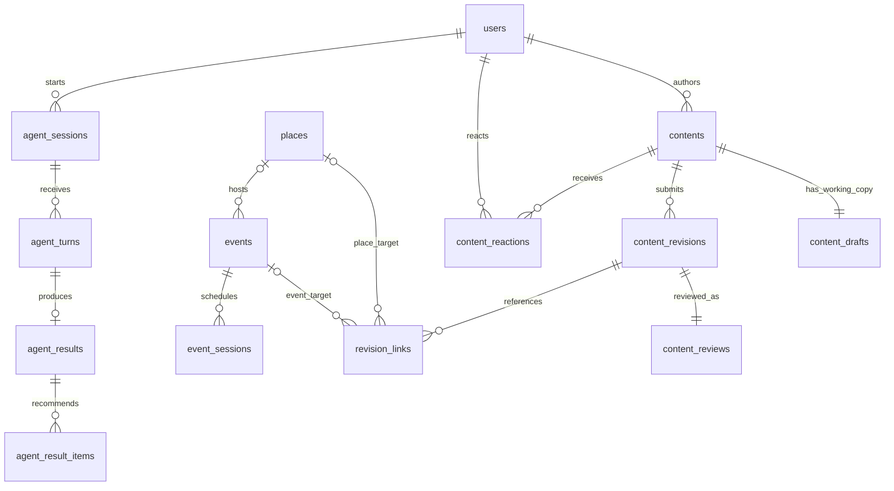

# 数据库表与数据模型

> 以下是第一版拟实施的数据字典，不是已经运行的数据库迁移。所有业务表在 PostgreSQL 的 `public` schema；LangGraph 自带的检查点表使用独立 `agent_runtime` schema 并由对应库维护。此处 schema 指数据库命名空间；接口字段结构另见接口文档。

## 1. 先划清三种数据

用户看到的是文章或笔记，推荐需要的是时间、地点、费用等事实。数据库因此分别保存：可阅读的内容 `contents`；可参与的活动 `events` 和可访问的地点 `places`；仅对本人可见的 Agent 推荐结果 `agent_results`。

一篇 Editor 文章可引用多场活动，也可只介绍一个地点；一场活动可被多篇文章和用户笔记提及。Notes 的作者必须是实际用户；AI 辅助 Editor 的文章仍是平台编辑内容，不能自动插入 Notes 流。Agent 推荐文章也不自动作为用户帖子发布。

为避免用户修改已发布内容时，未完成的句子立刻公开，每条内容包含一个可修改草稿和若干不可变提交版本。`contents` 只保存当前公开版本的编号。草稿保存、审核和公开版本切换是三个独立动作。

下面只画核心关系；一对多连线表示左侧一条记录可对应右侧多条记录，完整字段与约束以之后的数据字典为准。

## 2. 通用字段约定

- 所有独立实体的 `id`：`uuid` 主键，由服务端生成；关联表另行声明组合主键。
- 下文未标 `?` 的字段均 `NOT NULL`；`?` 表示允许 SQL NULL。NULL 不能代替空数组或空对象。
- 除特别说明外每张表有 `created_at timestamptz NOT NULL DEFAULT now()`；可变表另有 `updated_at timestamptz NOT NULL`，由写服务更新。下文标“不可变”的表不带 updated_at。
- `uuid → table` 表示外键引用目标表 id。默认 `ON DELETE RESTRICT`；账户注销通过明确清理流程处理，不依赖大范围隐式级联删除。
- 状态字段使用 `text + CHECK`，可选集合在各表列出；Python 使用字符串枚举，接口导出同一取值集合。
- 时间存 `timestamptz`；接口使用带时区的 ISO 8601；“今晚”等词按用户选择城市的时区解析。上海默认 `Asia/Shanghai`。
- 钱存整数“分”，币种 `char(3)` 默认 CNY。未知价格用 NULL 并附 price_status，绝不能用 0 代替未知。
- 富文本、选项和状态快照使用 `jsonb`；字段 schema 版本单独存 `smallint`。外键、权限、状态、排序字段不能只藏在 JSON 内。
- 数据库 CHECK 验证单行性质；跨表的作者身份、公开状态、引用媒体归属等由事务服务检查。下文明确标注需要触发器或服务保证的约束，不声称普通外键能够校验内容。

## 3. 身份、权限与兴趣

### users — 账户与基础资料，可变

| 字段 | 类型/约束 | 用途 |
|---|---|---|
| id | uuid PK | 账户编号 |
| phone_lookup_hash | text? UNIQUE | 规范化手机号的服务端密钥 HMAC，用于查找；注销后清空 |
| phone_ciphertext | text? | 加密手机号，发送短信时解密；密钥不在数据库 |
| display_name | varchar(40) | 默认昵称可由服务端生成 |
| bio | varchar(300)，默认空串 | 简介 |
| avatar_asset_id | uuid? → media_assets | 只允许本人已通过检查的头像 |
| city_id | uuid? → cities | 默认城市，上海首发由用户确认 |
| status | active / suspended / deleted | 所有鉴权检查账户状态 |
| personalization_enabled | boolean DEFAULT true | 控制浏览等行为是否用于个性化；首次使用可修改 |
| terms_version | text | 首次登录接受的产品协议版本 |
| terms_accepted_at | timestamptz | 接受时间 |
| deleted_at | timestamptz? | 注销时设置 |

CHECK：phone 两列同时为空或同时非空；非 deleted 账户必须有手机号身份。原始手机号不进入日志或模型。HMAC 密钥带版本管理，换密钥时双读迁移，不能直接替换导致全部用户无法登录。

### user_roles — 操作权限，可变

`user_id uuid → users, role text CHECK IN (editor,moderator,admin)`，组合主键 `(user_id,role)`；另有 `granted_by uuid → users`。普通用户无需 member 行。初始化管理员通过受控部署命令建立，其余授权经 admin 接口并记录审计。Editor 写编辑稿，moderator 审核，admin 管理；可同人多角色，操作仍留痕。

### auth_challenges — 验证码挑战，可变

`id, phone_lookup_hash text, phone_ciphertext text, purpose text(login/delete_account), code_hmac text, delivery_code_ciphertext text?, expires_at timestamptz, attempts smallint DEFAULT 0, max_attempts smallint DEFAULT 5, resend_after timestamptz, consumed_at timestamptz?, delivery_status text(pending/sent/failed), terms_version text?`。

验证码不明文保存，HMAC 输入包含挑战 ID、手机号和验证码，防离线枚举短码。delivery_code_ciphertext 仅供发送任务短时读取，发送成功即清空；其加密密钥与校验密钥分离。校验在行锁事务中递增 attempts、检查期限并一次性设置 consumed_at；两个同时验证请求只有一个成功。索引 `(phone_lookup_hash, created_at DESC)`。同号码同用途新挑战使旧挑战过期；创建挑战通过号码与用途派生的 PostgreSQL 事务级 advisory lock 串行化，避免两个请求同时创建有效挑战。过期挑战按保留策略删除。

### auth_sessions — 每设备登录会话，可变

`id, user_id → users, client_type text(mobile/editor_web), device_label varchar(100), last_seen_at timestamptz, absolute_expires_at timestamptz, revoked_at timestamptz?`。

索引 `(user_id, revoked_at)`。访问凭证为短期签名 JWT（JSON Web Token，用签名验证内容未被篡改的字符串），只含 sub、sid、iat、exp、iss、aud；API 验证签名与有效期，再查会话未撤销、用户未封禁。角色由数据库读取，不信任客户端声明。目标访问有效期 15 分钟；续期会话最长 30 天后重新登录，值均可配置。

### refresh_tokens — 续期凭证轮换记录，可变

`id, session_id → auth_sessions, token_hash text UNIQUE, parent_id uuid? → refresh_tokens, expires_at timestamptz, used_at timestamptz?, revoked_at timestamptz?`。

服务端生成高熵随机串，数据库仅存摘要。每次续期锁定原 token 行，标记已使用并生成子 token；`parent_id` 非空时 UNIQUE，保证一个父 token 只有一个子 token。旧 token 重放撤销整个 session。客户端串行续期；若已成功的续期响应因断网丢失，重新登录，这是首版明确接受的严格轮换取舍，不悄悄复用旧 token。

### tags — 内容分类与兴趣词，可变

`id, slug varchar(64) UNIQUE, name varchar(40), category text(content_type/interest), enabled boolean DEFAULT true`。如 live_music、exhibition、cinema、city_walk；名称由运营维护，不让模型写任意新标签。

### user_interests — 明确偏好与推断偏好分开保存，可变

`user_id → users, tag_id → tags, source text(explicit/inferred), weight numeric(5,4) CHECK 0<=weight<=1, evidence_count integer DEFAULT 0 CHECK >=0, expires_at timestamptz?`；组合主键 `(user_id,tag_id,source)`。

explicit 来自用户选择，0 表示明确不感兴趣；inferred 由行为聚合作业计算，30 天滑动窗口并衰减。服务读取时 explicit 优先，不覆盖用户明确偏好；关闭个性化后不读取/更新 inferred，清理已有推断与相应 Agent 历史上下文。

## 4. 城市、地点、活动与来源

### cities / districts — 可筛选地域，可变

- `cities`: `id, code varchar(32) UNIQUE, name varchar(80), country_code char(2), timezone text, enabled boolean`。上海 seed 使用稳定内部 code `shanghai`、`CN`、`Asia/Shanghai`。
- `districts`: `id, city_id → cities, code varchar(32), name varchar(80)`；UNIQUE `(city_id,code)` 和 `(id,city_id)`。

### places — 可重复访问的地点，可变

`id, city_id → cities, district_id uuid?, name varchar(200), category_tag_id → tags, address text, latitude numeric(9,6)?, longitude numeric(9,6)?, timezone text, opening_hours jsonb, price_status text(free/known/unknown), price_min_fen integer?, price_max_fen integer?, price_basis text(per_person/reference), currency char(3), status text(draft/active/closed), verified_at timestamptz?, version integer DEFAULT 1`。

UNIQUE `(id,city_id)`；复合外键 `(district_id,city_id) → districts(id,city_id)`；经纬度同时为空或同时存在并限制合法范围。营业时间结构见接口文档，不能只是没有规则的一段字符串。价格范围非负且 min<=max，known 必须有上下界，free 上下界为 0，unknown 都为 NULL。索引 `(city_id,status,category_tag_id)`、`(city_id,district_id)`。第一版按区域匹配，距离估算不能冒充实时导航。

### events — 一项活动，可变

`id, city_id → cities, place_id uuid?, category_tag_id → tags, title varchar(200), description text, organizer varchar(200)?, attendance_mode text(fixed_start/flexible_entry), status text(draft/published/cancelled/ended), booking_url text?, price_status text(free/known/unknown), price_min_fen integer?, price_max_fen integer?, price_basis text(per_person/reference), currency char(3), verified_at timestamptz?, version integer DEFAULT 1`。

UNIQUE `(id,city_id)`；`(place_id,city_id) → places(id,city_id)` 防止上海活动误指向别的城市。价格约束同 places，索引 `(city_id,status,category_tag_id)`。活动持续时间从场次获取；展览按营业日期生成可预约/可参与区间，不能把跨度一个月直接当成全天开放的单一场次。

### event_sessions — 活动的具体场次，可变

`id, event_id → events, starts_at timestamptz, ends_at timestamptz, last_entry_at timestamptz?, timezone text, status text(scheduled/cancelled/sold_out), booking_url text?, price_status text(free/known/unknown), price_min_fen integer?, price_max_fen integer?, price_basis text(per_person/reference), currency char(3), verified_at timestamptz?, version integer DEFAULT 1`。

CHECK ends_at > starts_at；非空 last_entry_at 必须在 starts_at 与 ends_at 之间；价格规则同上。UNIQUE `(id,event_id)` 和 `(event_id,starts_at,ends_at)`；索引 `(starts_at,event_id) WHERE status='scheduled'`。推荐优先用场次价格，若场次未知、活动有已核验价格，可返回带“活动参考价”标记的价格；未知票务库存不能宣称有票。场次只能表达已知时间，用户到场时间仍需校验。

### source_documents — 可追溯资料，不可变

`id, url text, canonical_url_hash text, publisher varchar(200)?, title text, excerpt text, fetched_at timestamptz, content_hash text, trust_level text(official/editor_confirmed/unverified), facts_json jsonb, schema_version smallint DEFAULT 1`。

UNIQUE `(canonical_url_hash,content_hash)`。保留必要摘录、提取事实和来源，不默认存整站全文。facts_json 包含事实名、值、来源片段、提取时间；它是候选资料，不自动覆盖正式 events/places。

### catalog_sources — 正式事实关联到来源，不可变

`id, source_id → source_documents, event_id uuid? → events, place_id uuid? → places, field_name varchar(80), confirmed_by → users, confirmed_at timestamptz`。

event_id/place_id 恰一个非空；为两种目标分别建部分 UNIQUE `(source_id,event_id,field_name)`、`(source_id,place_id,field_name)`。一个事实可有多个来源。Editor 确认某个来源支持“活动时间”后才建立记录；模型提取不代表人工确认。

## 5. 媒体与内容版本

### media_assets — 图片的存储与处理状态，可变

`id, owner_id → users, purpose text(content/avatar/editorial), storage_key text UNIQUE, declared_mime text, verified_mime text?, size_bytes bigint?, width integer?, height integer?, sha256 text?, status text(pending/processing/ready/rejected/deleted), visibility text(private/public), variants jsonb DEFAULT '{}', rejection_code text?, upload_expires_at timestamptz, deleted_at timestamptz?`。

索引 `(owner_id,status,created_at DESC)`。pending 只代表获得上传许可；ready 才可被提交。图片必须服务端读取文件头并解码确认，去除位置等 EXIF 元信息，产生缩略图。variants 记录文件 key、宽、高、字节大小，不保存会过期的签名 URL。草稿图片初始私有，公开内容引用或头像审核通过后才允许公开变体访问；删除最后一个公开引用时收回公开访问并失效 CDN 缓存。用户屏蔽阻止新内容分发，不保证已经取得的公共图片链接或离线副本立即不可读；私有草稿原图始终走授权签名访问。

### contents — 一篇内容的稳定身份，可变

`id, kind text(note/editorial), author_id → users, city_id → cities, status text(draft/published/hidden/deleted), published_revision_id uuid?, published_at timestamptz?, first_published_at timestamptz?, editorial_rank integer DEFAULT 0, version integer DEFAULT 1, deleted_at timestamptz?`。

索引 `(kind,city_id,first_published_at DESC,id DESC) WHERE status='published'`；作者索引 `(author_id,created_at DESC)`。`published_revision_id` 引用下表，并以 `(published_revision_id,id) → content_revisions(id,content_id)` 保证该版本属于这篇内容。创建时先插入无公开版本的 contents，再保存草稿；迁移分两步创建循环外键。

CHECK：published 状态必须有公开版本和发布时间；deleted 必须有 deleted_at。没有公开版本的内容只允许 draft/deleted。editorial_rank 仅 editor/admin 可改；kind、author_id 创建后不可由普通更新接口更改。跨表规则由发布服务在事务中校验：当前版本审核已通过、引用媒体可用、作者有效、editorial 作者有 editor 权限。

### content_drafts — 每篇内容一个可编辑工作副本，可变

`content_id uuid PK → contents, title varchar(100) DEFAULT '', document jsonb, document_schema_version smallint DEFAULT 1, cover_asset_id uuid? → media_assets, excerpt varchar(240) DEFAULT '', tag_ids uuid[] DEFAULT '{}', link_refs jsonb DEFAULT '[]', edit_version integer DEFAULT 1, last_edited_by → users`。

草稿允许标题和正文尚未完成，提交时才执行完整发布校验。草稿 tag_ids 与 link_refs 是编辑工作数据；保存和提交均校验目标存在，发布时转为具有真实外键的关联行。不把可编辑数组当成公开查询的数据来源。

### content_revisions — 每次提交的完整不可变快照

`id, content_id → contents, revision_no integer, based_on_edit_version integer, title varchar(100), document jsonb, document_schema_version smallint, plain_text text, excerpt varchar(240), cover_asset_id uuid? → media_assets, authoring_mode text(human/ai_assisted), submitted_by → users, body_hash text`。

UNIQUE `(content_id,revision_no)`、`(content_id,based_on_edit_version)`、`(id,content_id)`。标题/正文发布约束见接口文档。plain_text、excerpt 和 body_hash 由后端从校验后的正文派生，不信任客户端提供。Note 的 authoring_mode 第一版只接受 human；Editor 可 human/ai_assisted。

### revision_assets / revision_links / content_tags — 正式版本引用，不可变

- `revision_assets`: `revision_id → content_revisions, asset_id → media_assets, position integer CHECK >=0, role text(inline/cover)`；PK `(revision_id,asset_id,role)`。同图片多次出现时 position 记录首次出现；正文保留所有节点顺序。
- `revision_links`: `id, revision_id → content_revisions, event_id uuid? → events, place_id uuid? → places, position integer CHECK >=0`；恰一个目标非空；两类目标分别建部分 UNIQUE `(revision_id,event_id)` / `(revision_id,place_id)`。
- `content_tags`: `revision_id → content_revisions, tag_id → tags`；PK `(revision_id,tag_id)`，索引 `(tag_id,revision_id)`。

名字 content_tags 的实际关联粒度是“版本”，所以用户改草稿标签不会立刻改变公开 Feed。公开查询只读取 published_revision_id 对应的关系。

### content_reviews — 某个提交版本的当前审核状态，可变

`id, revision_id → content_revisions UNIQUE, status text(pending/approved/rejected), automated_findings jsonb DEFAULT '{}', reviewer_id uuid? → users, reason_code text?, reviewer_note text?, reviewed_at timestamptz?, version integer DEFAULT 1`。

CHECK：终态必须有 reviewed_at；人工操作须 reviewer_id；自动通过可为空，但审计 actor_type=system。第一版支持文本/图片检查，接入失败时保持 pending 并进入人工队列，不能默认通过。Editor 文章必经人工批准，普通 Note 按配置自动通过或转人工。索引 `(status,created_at)`。

**版本切换事务：**审核服务锁 contents 行，检查内容未被删除/隐藏、提交版本仍是最新 submitted revision，再切换 published_revision_id；旧公开版本在新版本审核期间继续可读。旧审核任务即便迟到，也只能更新自己的审核结果，不得覆盖较新提交。修改草稿不会使已提交版本自动作废；用户撤销提交需独立操作取消发布资格并记录审计，首版界面可以不提供撤销功能。

## 6. 互动与用户行为

### content_reactions — 点赞与收藏，可变

`user_id → users, content_id → contents, kind text(like/bookmark)`；组合 PK `(user_id,content_id,kind)`，索引 `(user_id,kind,created_at DESC)`、`(content_id,kind)`。PUT 表示存在，DELETE 表示不存在，重复调用幂等。首版实时聚合当前页计数；量大再增加可重建计数表，不能把缓存计数作为事实。

### event_participations — 用户表达的参与状态，可变

`id, user_id → users, event_id → events, session_id uuid?, state text(interested/attended), attended_at timestamptz?, origin_agent_result_id uuid? → agent_results`；UNIQUE `(user_id,event_id)`；复合 FK `(session_id,event_id) → event_sessions(id,event_id)`。索引 `(user_id,state,updated_at DESC)`。

interested 是想去，attended 是用户自报去过；attended_at 必填且不晚于当前时间由服务校验。origin_agent_result_id 只能指向本人结果，并由服务器验证该结果引用同一 event，不能仅因客户端填写编号就计为推荐转化。

### behavior_events — 有界的行为事实，不可变

`id, client_event_id uuid, user_id → users, event_type text(impression/detail_view/agent_open/direction_select/result_view/outbound_click/note_publish), content_id uuid? → contents, agent_session_id uuid? → agent_sessions, agent_result_id uuid? → agent_results, occurred_at timestamptz, received_at timestamptz, dwell_ms integer?, feed_snapshot_id uuid?, metadata jsonb DEFAULT '{}'`。

UNIQUE `(user_id,client_event_id)`；索引 `(user_id,received_at DESC)`、`(event_type,received_at)`。按类型校验目标字段：impression/detail_view 必须 content_id；agent_open/direction_select 必须 agent_session_id；result_view 必须 agent_result_id；note_publish 必须由服务端发布事务写入。客户端接口仅接受可上报白名单，不能伪造发布成功。metadata 限定具体键与大小，禁止任意对象上传。

客户端曝光建议为卡片可见面积≥50%且持续≥800ms，作为产品统计口径，不是已被服务器证实的真实观看。服务端限制时间偏差、每批条数和重复曝光频率。当前可见卡片随 Agent 请求单独提交，不依赖延迟到达的埋点来猜视口。

### user_blocks — 用户屏蔽，可变

`user_id → users, blocked_user_id → users`；组合 PK；CHECK 两者不同。Feed/详情/Agent 检索统一排除被当前用户屏蔽的作者；不把屏蔽关系当作公开信息。

### reports — 举报处理，可变

`id, reporter_id → users, content_id → contents, revision_id → content_revisions, reason text(spam/abuse/inaccurate/other), description varchar(1000), status text(open/resolved/dismissed), resolved_by uuid? → users, resolution_note text?`。

复合 FK `(revision_id,content_id) → content_revisions(id,content_id)`；索引 `(status,created_at)`。记录被举报的具体版本，防止内容修改后无法复核。

## 7. Agent 与编辑辅助

### agent_sessions — 用户的一次发现会话，可变

`id, user_id → users, client_session_id uuid, open_request_hash text, city_id → cities, mode text(guided/chat), stage text(directions/clarifying/generating/completed/failed), state_version integer DEFAULT 1, context_snapshot jsonb, slots jsonb DEFAULT '{}', latest_output jsonb, clarification_rounds smallint DEFAULT 0, active_turn_id uuid?, expires_at timestamptz, deleted_at timestamptz?`。UNIQUE `(user_id,client_session_id)`，重复打开请求先通过 open_request_hash 校验与原请求输入一致，再返回原会话。

context_snapshot 是经过服务器过滤后的视口编号、兴趣摘要与行为摘要，并附采集时间和 context_schema_version；slots 是时间、预算、区域、同行等条件及来源。快照不保存手机号、精确轨迹或整段浏览历史。索引 `(user_id,updated_at DESC)`。`active_turn_id` 复合 FK `(active_turn_id,id) → agent_turns(id,session_id)` 在建表后添加。

### agent_turns — 一次用户输入与其输出，可变直到终态

`id, session_id → agent_sessions, client_turn_id uuid, input_type text(open/choose_direction/answer/text/retry), input_payload jsonb, expected_state_version integer, status text(queued/running/completed/failed/cancelled), output_payload jsonb?, error_code text?, model_id text?, prompt_version text, usage_json jsonb DEFAULT '{}', finished_at timestamptz?`。

UNIQUE `(session_id,client_turn_id)`、`(id,session_id)`；部分 UNIQUE `(session_id) WHERE status IN ('queued','running')`，每会话同时只有一个生成任务。usage_json 定义 input_tokens、output_tokens、provider_request_id、estimated_cost_micros、currency；不要求供应商都能提供成本，缺失明确为 NULL。input_payload 与 output_payload 的判别联合结构见接口文档。

### agent_results — 私有杂志式推荐文章，不可变正文、可变保存状态

`id, session_id → agent_sessions, turn_id → agent_turns UNIQUE, user_id → users, title varchar(100), dek varchar(300), article jsonb, schema_version smallint, assumptions jsonb, evidence_snapshot jsonb, generated_at timestamptz, valid_until timestamptz, saved_at timestamptz?, deleted_at timestamptz?`。

`(turn_id,session_id) → agent_turns(id,session_id)`；服务检查 user_id 与 session 所有人一致。索引 `(user_id,saved_at DESC) WHERE saved_at IS NOT NULL`。article 存分节正文与推荐项；evidence_snapshot 保存引用事实的版本、核验时间和来源编号。到期并非自动删文，而是必须刷新活动状态，显示“条件可能已变化”。

### agent_result_items — 结果里的可操作对象，不可变

`id, result_id → agent_results, event_id uuid? → events, place_id uuid? → places, session_id uuid?, position integer CHECK >=0, reason text, source_ids uuid[]`。

event_id/place_id 恰一个非空；place 项 session_id 必须 NULL；`(session_id,event_id) → event_sessions(id,event_id)`；UNIQUE `(result_id,position)`。source_ids 属快照但写入时逐一验证来源存在、证据支持；若需要完整外键审计，实施时展开为子关联表，不将数组当作权限依据。

### editorial_runs — 一次 Editor 研究任务，可变

`id, requested_by → users, city_id → cities, brief text, status text(queued/researching/drafting/needs_review/failed), source_ids uuid[] DEFAULT '{}', proposed_facts jsonb DEFAULT '[]', suggested_draft jsonb?, draft_content_id uuid? → contents, base_edit_version integer?, model_id text?, prompt_version text, usage_json jsonb DEFAULT '{}', error_code text?`。

所有来源来自 source_documents，数组保存本次工作清单。拟提取事实与正式 catalog 数据分离；Editor 确认后才由 catalog 服务写事实并产生 catalog_sources。draft_content_id 必须 kind=editorial，且 authoring_mode=ai_assisted 的版本不能绕过人工审核。

## 8. 执行、去重与审计

### jobs — 待执行任务，可变

`id, kind text(send_otp/process_media/review_content/agent_turn/editorial_research/aggregate_interests/cleanup), aggregate_id uuid, dedupe_key text UNIQUE, payload jsonb, status text(queued/running/succeeded/failed/cancelled), attempts integer DEFAULT 0, max_attempts integer DEFAULT 3, available_at timestamptz, lease_owner text?, lease_until timestamptz?, last_error_code text?, finished_at timestamptz?`。

aggregate_id 为任务目标编号，因可指向不同表，**不假装具有数据库外键**；每个任务 kind 对应一个严格 payload schema，入队与领取时验证目标。索引 `(available_at,id) WHERE status='queued'` 与 `(lease_until) WHERE status='running'`。payload 只放必要编号，不复制图片、验证码或全文。短信任务读取受限挑战记录的 delivery_code_ciphertext，解密发送后清除，具体发送策略见接口文档。

### job_steps — 重试过程中的外部结果与副作用凭据，可变

`job_id → jobs, step_key varchar(100), status text(started/completed), output jsonb?, external_request_id text?, completed_at timestamptz?`；组合 PK `(job_id,step_key)`。用于缓存检索/模型结果和记录最终入库是否完成；模型请求超时而供应商不支持去重时仍可能重复计费，不能声称数据库能保证外部调用恰好一次。

### idempotency_records — 创建/发布接口的重试去重，不可变

`id, user_id → users, operation varchar(100), key varchar(100), request_hash text, resource_id uuid, response_status smallint, expires_at timestamptz`；UNIQUE `(user_id,operation,key)`，索引 expires_at。保存资源引用，不保存明文访问/续期 token。第一版只覆盖内容创建、提交发布、媒体初始化、Editor 研究创建；Agent 用 client_turn_id 去重。相同键不同请求体返回 409。

### audit_logs — 关键状态变化记录，不可变

`id, actor_type text(user/system), actor_id uuid? → users, action varchar(100), target_type varchar(60), target_id uuid, before_summary jsonb?, after_summary jsonb?, request_id uuid, reason text?`。

索引 `(target_type,target_id,created_at DESC)`。同样不对多态 target_id 声称外键保护。角色变更、人工审核、发布、下架、封禁和来源确认与业务事务一起写审计；摘要不含敏感凭证。

## 9. 重要跨表不变量

| 不变量 | 执行位置 |
|---|---|
| Note 作者必须是发起用户，editorial 必须由 editor/admin 发起 | content 创建服务；身份从登录会话获取 |
| 发布指针只能指向同一内容版本 | 数据库复合 FK |
| 待审版本不能覆盖更晚的提交或恢复已删除/隐藏内容 | 发布事务的行锁与 revision_no 检查 |
| 作者上传的图片才能进入本人草稿，Editor 共享图片必须有明确后台权限 | media/content 服务；提交时重验 |
| 公开内容的 title/document/tags/media 来自同一 published revision | discovery/detail 查询统一连接 |
| 每会话最多一个待执行 turn，旧客户端状态不能覆盖新选择 | 部分唯一索引、state_version 原子更新 |
| Agent 结果的引用符合用户城市、条件和可访问范围 | 生成前过滤、生成后再验、打开时刷新动态事实 |
| 下架、屏蔽内容不能因缓存继续进入新推荐 | 缓存读出后二次可见性过滤 |

## 10. 保留、删除与索引演进

以下是产品数据最小化的初始工程配置，不是法律结论，上线时结合实际业务要求确认。

| 数据 | 初始保留策略 |
|---|---|
| 验证码与发送材料 | 5 分钟有效；过期后 24 小时内清除敏感材料 |
| 原始浏览行为 | 90 天；推断偏好采用最近 30 天窗口 |
| 未保存 Agent 会话、结果与检查点 | 最后活动后 30 天删除；删除跨 public/agent_runtime 执行 |
| 用户保存的 Agent 文章 | 用户删除或注销；到期仍展示事实需刷新标记 |
| 未引用上传文件 | 24 小时后回收；确认不存在草稿/公开版本/头像引用 |
| 草稿 | 用户保留期间保存；本地缓存仅限对应账户 |
| 已删除内容 | 立即不可访问，30 天后清理文件和个人正文；必要审计只留最小摘要 |
| 成功任务、步骤输出、接口去重记录 | 去重记录至少 24 小时；任务 7 天后清理，未终态任务不清理 |

注销流程先撤销全部会话、隐藏内容和图片访问，再异步删除手机号、兴趣、行为、Agent 会话/检查点、草稿与媒体，昵称匿名化；已产生外键引用的 users 行保留 tombstone（只含不可识别编号与 deleted 状态）。清理任务可重试并有完成审计。私人数据不得只删业务表而遗漏检查点。

首版不提前分库分表。上线后根据慢查询为行为表按月份分区、为计数增加聚合表；所有新增缓存和聚合均应可从事实表重建。
