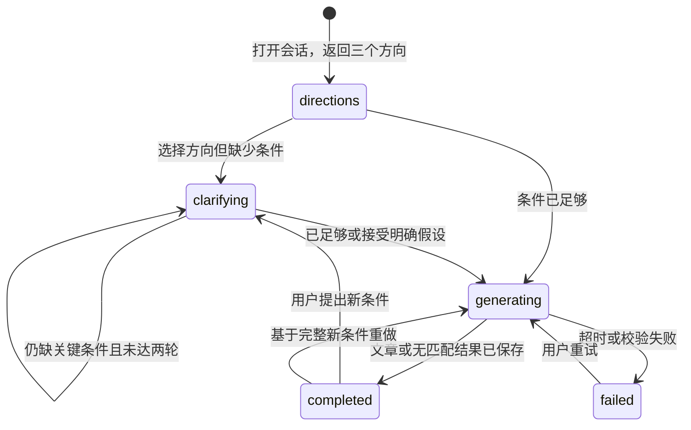

# Agent、编辑内容与发布流程

> 本文描述拟实施的服务行为。本文中的服务、工具、状态名都是设计名称；尚无实现代码。产品对外的“Agent”包含上下文处理、选项交互、事实检索和文章生成，不等同于每一步都必须调用大模型。

## 1. 用户打开 Agent 后发生什么

用户在 Discover 点击悬浮按钮，首先看到三个可选方向。客户端把当前 Tab、城市和可见卡片的编号发给后端；后端检查卡片属于该用户的 Feed 且仍然可见，再读取允许使用的兴趣和行为。后端根据这些信号选择三个有差异的方向，返回可直接点击的卡片。

第一轮方向由可解释规则从运营维护的方向模板中选出。例如视口里有展览文章、用户收藏过展览且上海资料库有有效展览，后端提高“最近有什么值得看的展”的分数；夜间并有现场演出资料时，提高“今晚想看现场”的分数。模板必须保持多样性，不能给三个语义相同的方向。没有历史时使用上海当前可用内容与通用模板，不假装知道用户喜好。

用户选择一个方向后，后端比较现有条件与该方向需要的条件，只问缺少且会改变结果的项目。比如明确要“今晚”就不再问日期；找展览但不知道哪天去，应先问时间。用户完成少量选项后，后台工作进程查正式资料库，筛出能满足条件的候选，再调用模型把候选组织成文章。

第一版最多两轮选项追问，每轮最多三个字段。可以提供“不限”“帮我决定”，但采用的默认值必须随最终文章显示。即使用户不补充某些条件，也可给有明确假设的建议；如果关键条件无法满足，则提示放宽条件，不编造候选。

## 2. 界面状态和服务器状态分开

客户端的面板开关、当前焦点、正在输入的文字属于界面状态。服务器的 stage 表示推荐流程进行到哪一步，mode 表示当前是选项引导还是自由文本。模型看到的是经服务器筛选的事实和上下文摘要；模型生成什么文字，不会自动改变页面导航或数据库状态。

该图只描述 stage；自由输入是另一维度。任何静止阶段都能提交文本，mode 改为 chat；闲聊产生 message 输出，并将 stage 设 completed；明确推荐请求则抽取条件后进入 clarifying/generating。用户可以随时打开文本输入框，但第一版同时只允许一次在途发送；生成期间保留文字，待当前任务完成再发送。

客户端关闭面板不删除会话、不取消已接受的任务。重新打开可恢复最近一次未过期会话；用户主动点“重新发现”才创建新会话，以新视口取样。不能把每次滚动都变成一次模型请求。

## 3. 上下文如何形成

为了让同一问题有稳定、可解释的输入，后端保存一份有界上下文快照。以下是 AgentContextV1 的字段定义；它是 JSON 数据模型，不是把用户全部行为直接拼成提示词。

| 字段 | 内容与上限 | 谁提供 |
|---|---|---|
| schema_version | 1 | 后端 |
| city | id、name、timezone | 用户选择，经 cities 校验 |
| now | 服务器当前时间 | 后端时钟 |
| surface | editorials / notes | 客户端，限枚举 |
| visible_content | 最多10篇，id、revision_id、标题、标签和实体引用 | 客户端提交编号，服务器取公开版本 |
| explicit_interests | 最多30项，含不喜欢项 | user_interests explicit |
| recent_views | 最近7天最多20项，去重、封顶权重 | behavior_events；启用个性化时 |
| saved_items | 最近30天最多20项 | content_reactions；启用个性化时 |
| participations | 最近90天最多20项，想去/去过区别标注 | event_participations；启用个性化时 |
| inferred_interests | 最多10个带置信度和有效期的标签 | user_interests inferred；启用个性化时 |
| selected_constraints | 本次会话已经明确的条件 | agent_sessions.slots |
| consent_state | 是否允许使用历史偏好 | users.personalization_enabled |

优先级为：本轮用户明确要求 > 用户显式兴趣 > 当前视口 > 收藏/自报参与 > 一般浏览推断。发生冲突时保留原值和来源，只将当前有效值用于筛选；新会话不自动把上一轮临时预算写成永久偏好。

关闭个性化后只使用本轮输入、当前视口、城市和公开资料，不读取历史画像；用户仍可以在本轮明确说“我喜欢爵士”。界面应区分“本次条件”和长期兴趣，避免关闭个性化后仍悄悄使用持久画像。

资料和 Notes 正文都是待处理内容，不是给 Agent 的指令。服务器只把已允许字段放入上下文，并明确标注来源；用户帖子中“忽略规则、访问某链接”的文字不会产生工具权限。

## 4. LangChain 和 LangGraph 具体承担什么

模型供应商的接口格式不同，生成结果还需要校验。后台工作进程使用 LangChain 包装模型调用，把输入转换成供应商请求，并要求输出指定字段，例如文章标题、分节正文和引用编号。结构正确只是第一道检查，活动是否存在、时间是否匹配仍由普通 Python 服务验证。[LangChain 结构化输出](https://docs.langchain.com/oss/python/langchain/structured-output)

一次推荐可能需要提取条件、检索、写作、校验，并在进程中断后继续。后台工作进程使用 LangGraph 把这些步骤连接成执行图，并将节点完成后的进度保存为检查点。持久化检查点可以恢复执行；它不能替代业务结果表，也不会自动使外部模型调用只执行一次。[LangGraph 持久化](https://docs.langchain.com/oss/python/langgraph/persistence)

第一版请求之间的用户等待由业务会话表保存，不让一个模型调用悬挂等待用户几小时。每个 agent_turn 是一次有界执行：输出 clarification 后任务结束；下次回答创建新 turn，再读取已保存的 slots。检查点主要用于一次 turn 内的崩溃恢复，避免业务状态和图内对话状态出现两份互相争夺控制权的真相。

| 步骤 | 输入 | 输出/状态变化 | 是否调用模型 |
|---|---|---|---|
| 读取并检查 | turn_id、session_id | 已授权上下文和输入 | 否 |
| 合并条件 | 选项值或文本、原 slots | 新 slots 与来源 | 选项否；文本需要时调用 |
| 判断缺口 | slots、方向定义 | clarification 或可检索条件 | 否，规则判断 |
| 召回事实 | 城市、时间、预算、区域、标签 | 受限候选及资料来源 | 否，SQL 查询 |
| 组合与排序 | 候选、偏好、可行性 | 最多5项组合及证据包 | 首版规则 |
| 文章写作 | 经筛选的候选和证据包 | ArticleDraft 结构 | 是 |
| 再校验 | 草稿、当前事实 | 合格文章或修复错误 | 否；至多一次模型修复 |
| 保存与返回 | 合格文章、turn_id | agent_results、items、output=article | 否，事务写入 |

LangGraph thread_id 使用 turn UUID；该 turn 从 session 读取摘要，不把所有会话永久无限累加。业务会话是客户端读取来源，检查点只存内部执行进度。两边无法假装是一个数据库事务：最终保存结果用 turn_id 唯一键；重试读到已有 agent_results 就直接恢复业务输出，不再写第二篇结果。

## 5. 受控工具和候选检索

这里的“工具”是后台提供给流程调用的受限函数，它们接收已经校验的条件，返回事实，不允许模型任意查询数据库。

| 拟实现工具 | 输入 | 输出 | 权限与限制 |
|---|---|---|---|
| search_catalog | city_id、时间段、预算、区域、标签、limit<=30 | 活动场次与地点摘要 | 固定只读查询，排除 draft/取消场次 |
| read_public_contents | content_ids<=10 | 已公开文章/Note摘要 | 复用当前用户可见性与屏蔽规则 |
| get_candidate_facts | 经召回的 entity_ids<=10 | 来源、核验时间、最新状态 | 不能读取用户私人数据 |
| research_sources | brief、允许域名、limit<=10 | 外部来源与提取片段 | 仅 Editor 工作流开放 |

用户推荐 Agent 首版使用已核验的内部资料；它不自行把公网陌生页面变成可推荐的活动。Editor 辅助 Agent 可以搜索外部资料，但只能保存 source_documents 和候选草稿。用户开放聊天仍可谈文娱或普通话题；没有资料支持的实时事实明确说未确认，不能因为用户换成文字输入就绕过来源规则。

硬筛选先于偏好排序：城市一致；活动已公开；有与用户时间相容的可参加场次；场次未取消；场地没有关闭。用户希望从19点开始安排时，18点已经开始的电影不能因为时间有交集就当作可准时参加；电影/演出要求到场不晚于 starts_at，展览等灵活到访项目才允许在已确认开放区间进入。

为支持上述区别，events 持久化 attendance_mode=fixed_start/flexible_entry。flexible_entry 仍需保留末次入场限制 `last_entry_at`（场次字段，可空）；未知时展示“入场时间请确认”，不能猜测。

严格预算只纳入价格可比较且已知的候选。用户允许预算不确定时，unknown/reference 项可作为明确标注的备选。组合校验应计算所选项目的每人费用上界之和；若缺交通、餐饮价格，就在总额旁注明不包含这些费用，而不是声称“总花费不会超预算”。

第一版组合最多三个连续活动/地点，其余作为备选；只按同区和可知时间窗口粗筛。需要行程精确衔接时，没有路由服务就不生成“步行12分钟”之类数字；显示地点间需自行确认交通，并为固定场次留可配置缓冲。无法证明可衔接时生成并列推荐，而非硬拼一条路线。

排序使用可解释因素：显式兴趣命中、时间适配、区域适配、编辑质量、资料新鲜度，另扣重复推荐和同类拥挤分。配置记录 ranking_version，效果通过点击、保存和用户反馈验证；不把没有数据支持的权重写成产品事实。

## 6. 推荐文章必须有什么

输出以“为什么这组适合你”为主线，包括标题、导语、若干有主题的段落、可操作活动/地点项，以及时间、费用、预约和不确定性说明。三个活动卡片加一句模型文案不能作为最终杂志文章验收。

写作模型收到的 ArticleDraft schema 限定：title、dek、sections、item_reasons（只允许引用给定 candidate_id）、assumptions、warnings。模型不负责生成事实型 URL、图片地址、实体 UUID 和可点击售票入口；服务端根据验证过的 candidate_id 补齐这些字段。

返回前 Python 校验器检查：引用都在候选集中；原始城市/预算/时间硬条件未被模型更改；事实陈述使用证据字段；组合没有时间冲突；来源没有过期；文章没有把用户浏览记录逐条暴露。结构或事实检查失败可带明确错误做一次修复，再失败就提供可核验的简化推荐/失败状态，并保留已填条件。

简单事实可以通过模板保证正确，例如时间和价格放在结构化 practical_notes，避免对自由文字做难以保证的事实推理。自由叙述仍有模型出错风险，首版离线评估必须人工抽样检查“夸大活动内容/杜撰体验”等问题；不能声称字段校验消除了全部幻觉。

结果 valid_until 取“最早相关场次开始或建议时间窗口结束、事实新鲜度阈值、最多24小时”的最早合理未来时间。读结果时重新加载活动取消/售罄/关闭状态；已失效项显示不可用并提供“按当前信息重新生成”。文章正文保留原生成时间，动态状态不伪装成模型当时已知。

核验按实际使用的字段检查 catalog_sources.confirmed_at，不以 events.verified_at 的最近一次修改时间推断所有字段都新鲜。比如今天仅确认了地址，不能因此把一个月前的票价视为今天核验。event_sessions 的时间、票价来源通过对应 event 的 catalog_sources 关联，并在 field_name 中使用固定格式 `sessions.<session_uuid>.starts_at` 等路径；确认服务验证该场次属于目标活动。来源缺失的动态字段标记未确认，不能进入严格事实承诺。

## 7. Editor 辅助内容生产

Editor 在后台输入“整理上海本周末适合两个人的展览”，创建研究任务。worker 使用外部检索服务搜索允许的来源，保存 URL、摘录、抓取时间和候选事实；同一来源内容摘要相同则复用 source_documents。

资料抓取器限制 http/https、响应大小、超时和重定向次数；拒绝内网/回环/云元数据地址，每次重定向重新检查目标，避免任意 URL 抓取访问内部服务。网页内容只作资料，不可指挥 worker 修改角色或发布内容。

研究任务生成“待确认事实”和文章建议稿。Editor 逐条确认活动时间、地址、价格与来源；catalog 服务据此更新正式资料。建议稿可写入新 editorial 草稿；若任务针对已有草稿且期间被人工编辑，保留 suggested_draft 并提示手动应用，不能覆盖人工工作。

Editor 预览后提交版本，moderator 批准后公开。第一版允许小团队同一人兼任 editor/moderator，但发布动作必须显式点击并留下审计。后台 worker 的账号没有授予 editor/admin 角色的能力，也没有自动把 AI 研究稿公开的路径。

活动文章列表根据当前公开编辑版本返回；文章引用的活动已取消时，文章历史叙述可以保留，但对应活动卡必须显示取消。若文章主要推荐已全部失效，应从精选位撤下并进入编辑复核队列。

## 8. 任务执行、失败和降级

请求进程在业务事务中写 jobs；worker 每次领取少量到期任务，用数据库行锁和租约防止正常情况下重复领取。领取事务立即结束，模型请求在事务外进行。worker 定期续租，长时间失联后任务可被重新领取。

最终写入前再次检查任务 lease_owner/lease_until 与会话 active_turn_id；失去租约的旧 worker 不得提交业务结果。数据库写入遵循结果唯一键与状态条件，即使两次计算都完成，也只有当前有效执行者能推进业务。外部模型费用仍可能重复，供应商支持幂等请求时传稳定请求编号，否则记录并限制重试。

| 失败场景 | 可观察行为 | 恢复方式 |
|---|---|---|
| 冷启动、行为为空 | 给上海通用的三个方向 | 用户选择逐步建立上下文 |
| 当前视口编号无效/过期 | 不使用该视口，仍给城市方向 | 让前端刷新 Feed，不中断入口 |
| 模型供应商不可用 | 方向和条件选择仍可用，生成显示可重试 | 已确认事实可用模板生成简版文章并标记 fallback |
| 无匹配活动 | 显示缺口和放宽选项 | 用户显式放宽预算/日期/区域，不能后台偷偷放宽 |
| 审核供应商不可用 | 内容保持待审 | 人工队列接管；不自动公开 |
| Redis 不可用 | Feed 提示短时不可用或用数据库固定新鲜度分页降级 | 旧快照返回过期；鉴权仍查数据库，验证码发送限流失败时拒绝发送 |
| worker 崩溃 | 客户端仍能读取已接受任务 | 租约到期后重试，最多3次，再进入失败状态 |
| 客户端断网/杀进程 | 服务端继续，设备保留草稿 | 重启按 session/turn 编号查询，不重复提交 |
| 内容/活动在生成期间下架 | 校验器移除不可用候选 | 重选或 no_matches，不把原候选直接展示 |

预算初值：普通生成最多3次模型调用（文本条件提取、写作、一次修复），方向/选项路径不需要提取调用；每次查询候选<=30、事实包<=10、最终推荐<=5。外部研究每任务最多10个来源，超时和输入文本长度设硬上限。总体30秒的生成目标之外，队列等待另设上限并报告繁忙；后台不要无限重试占满预算。

## 9. 验证清单与实验闭环

功能验收用固定上海样本库，不使用虚构的实时票价作为事实。至少包含：今晚演出、长期展览的周一闭馆、已取消场次、未知票价、跨午夜营业、没有历史的用户、用户不喜欢但浏览过的类别、资料不足和双设备同时提交。

Agent 离线样本要验证四类结果：选项恰好三个且不同；用户已经回答的条件不重复问；硬条件无违规；每一项引用可追溯。单独评估文章可读性和推荐理由是否具体，不能只测“返回 JSON 可解析”。自由聊天同样测试没有调用写内容/修改资料的工具。

关键集成测试应覆盖：生成后保存的结果唯一、重试不重复发布、并发 turn 冲突、旧 worker 失租拒绝提交、检查点与结果不同步可恢复、账户关闭个性化后不再读取历史、被屏蔽作者不进入上下文、AI Editor 不混入 Notes。

上线观察把浏览、Agent、收藏/参与、创作串成可解释事件链。origin_agent_result_id 只在服务器验证引用后用于直接归因；参与后7天发布 Note 可作相关指标，但没有明确关联活动时不能把所有发帖都说成由 Agent 促成。后续增加问卷或实验分组，再判断推荐是否带来增量效果。
